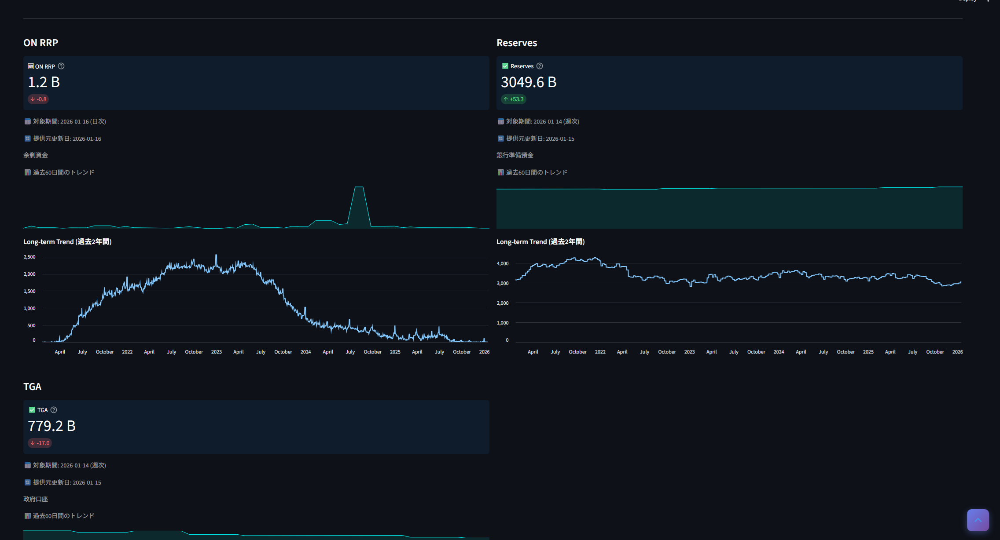
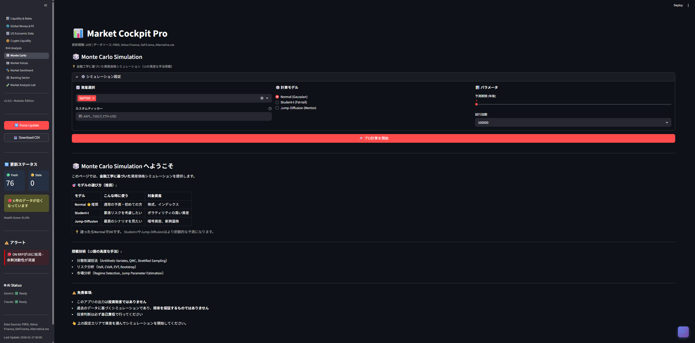

# 📊 Market Cockpit Pro

A Streamlit-based dashboard for monitoring financial market conditions 
with focus on **Fed liquidity** and **macro indicators**.

## Screenshots

### Liquidity & Rates

### AI Market Analysis

### Monte Carlo Simulation

I wanted to understand the real sources of market liquidity. As a long-term 
investor (not a day trader), my goal was to identify optimal entry points 
during major market downturns - based on primary data, not speculation.

I focused on free data from the Federal Reserve and other official sources, 
prioritizing critical indicators over flashy features.

## What Makes This Different

| Feature | Description |
|---------|-------------|
| **83 Indicators** | Fed balance sheet, global M2, credit conditions, sentiment |
| **Liquidity Focus** | Net Liquidity calculation, RMP alerts, ON RRP tracking |
| **Real Monte Carlo** | NumPy/SciPy implementation with EVT, Jump-Diffusion, VaR |
| **AI Analysis** | Evaluates market conditions based on all monitored data |

### Honest Limitations

- Data from free APIs (FRED, Yahoo Finance) - delayed, not real-time
- Personal analysis tool - **not investment advice**
- Maintained by one person - updates may be slow

## License

MIT License - free to use, modify, and distribute.

---

Built with curiosity about market plumbing. 🔧
